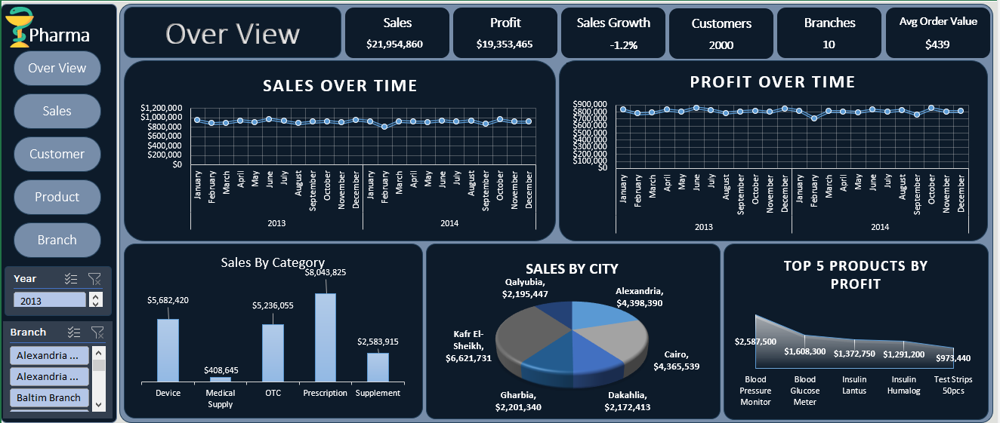
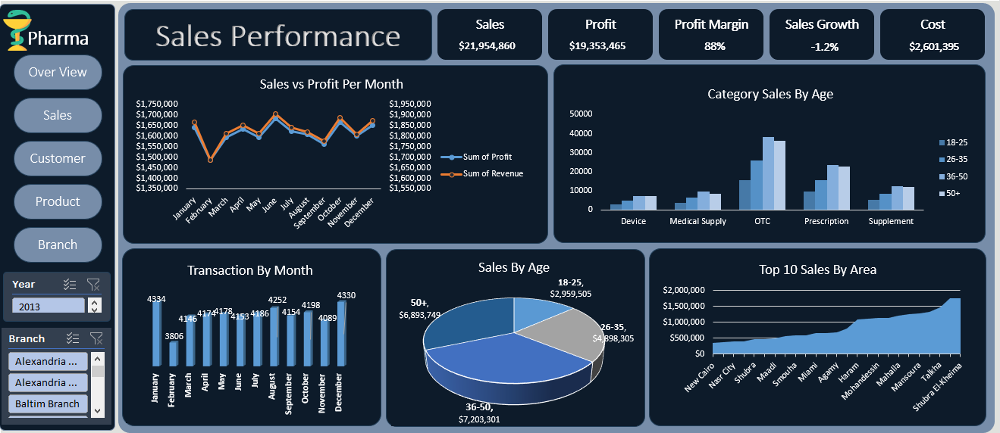
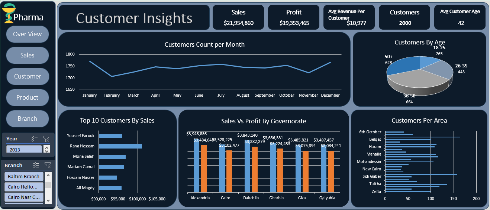
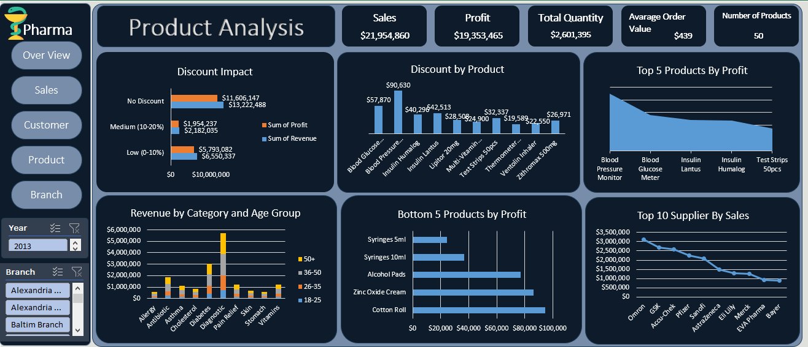
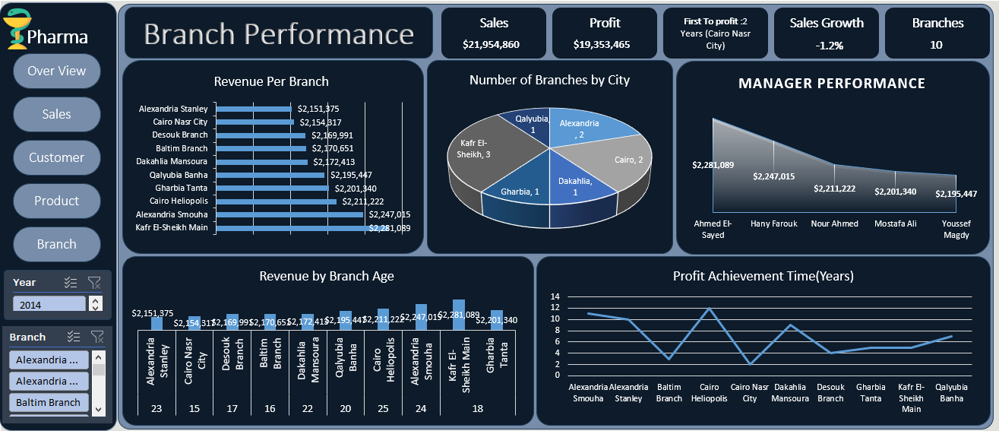

#  Pharma Analytics Dashboard — Advanced Excel Project

##  Project Overview

A comprehensive, multi-sheet analytical **Excel dashboard and report** built to track and evaluate pharmaceutical retail performance, sales revenue, profitability, customer behavior, and branch distribution.

This project transforms complex pharmaceutical transactional and demographic data into clear, descriptive insights to help management track monthly sales growth, evaluate high-performing branches, understand customer segments by age and category, and monitor top pharmaceutical products.

---

##  Project Objectives

- **Sales & Revenue Tracking:** Analyze monthly revenue trends, total profit margins, transaction volumes, and overall financial growth.
- **Customer Insights:** Evaluate customer age distribution, demographic segments, and purchasing behaviors across various categories.
- **Product & Inventory Analysis:** Track top-selling pharmaceutical products, medical supplies, devices, and profit contributions per category.
- **Branch Performance:** Assess regional and branch-level sales performance, geographical distribution, and branch maturity/metrics.

---

##  Tools & Technologies

- **Microsoft Excel** (Advanced Functions, Data Modeling & Structuring)
- **Power Query / Data Transformation**
- **Pivot Tables & Advanced Summarizations**
- **Data Visualization & Dashboard Layout Design**

---

##  Dashboard Sheets & Descriptive Analysis

### 1.  Overview Dashboard
The **Overview** dashboard acts as the primary executive entry point, providing high-level KPIs tracking total sales, profit, overall sales growth, customers, and active branches.
* **Key Metrics:** Total Sales of **$21.9M+**, Profit of **$19.3M+**, and an Average Order Value of **$439**.
* **Visual Breakdown:** Features time-series tracking of sales and profit over time, category breakdowns, city distribution, and top 5 products by profit.



---

### 2.  Sales Performance
The **Sales Performance** dashboard deep-dives into monthly sales versus profit trends, transaction distributions, and category performance across age brackets.
* **Key Insights:** Tracks exact monthly transaction volumes, high-demand product categories (OTC and Prescription leading the volume), and regional top sales across areas.



---

### 3.  Customer Insights
The **Customer Insights** dashboard analyzes customer segmentation, lifetime value, and demographic distribution.
* **Key Demographics:** Breaks down customer counts by core age groups (led by the 36-50 and 50+ brackets), tracks monthly customer trends, and highlights top customers and sales vs. profit by governorate.



---

### 4.  Product Analysis
The **Product Analysis** dashboard focuses on inventory performance, discount impact, and top-performing suppliers and medical products.
* **Key Metrics:** Evaluates discount categories, revenue by category and age group, top 10 suppliers (such as Omron, GSK, and Pfizer), and top/bottom products by profit contribution.



---

### 5.  Branch Performance
The **Branch Performance** dashboard evaluates branch-level revenue generation, manager effectiveness, and profit achievement timelines.
* **Key Metrics:** Compares branch revenues across major locations (e.g., Kafr El-Sheikh Main, Alexandria Smouha, Cairo Heliopolis), maps branch counts by city, and measures manager success metrics.



---

##  Skills Demonstrated

- Advanced Excel Data Modeling & Formatting
- Pharmaceutical Retail Analytics & KPI Tracking
- Exploratory Data Analysis (EDA)
- Executive Reporting & Dashboard Design
- Business Intelligence & Data Storytelling

---

##  Repository Structure

```text
Pharma-Analytics-Dashboard/
│
├── Pharma Analytics.xlsx
├── README.md
│
└── Screenshots/
    ├── Over_View.png
    ├── Sales_Performance.png
    ├── Customers.png
    ├── Prdouct_Analysis.png
    └── Branch_Performance.png

## 🚀 How to Use

1. Download the `.xlsx` file.
2. Open it using ** Excel **.
3. Start from the **Over View** landing page.
4. Use the navigation buttons to explore the dashboard.
5. Interact with the slicers and visuals to analyze the data.

---

## 👤 Author

**Omar Mosaad**

Data Analyst | Power BI | Excel | Python